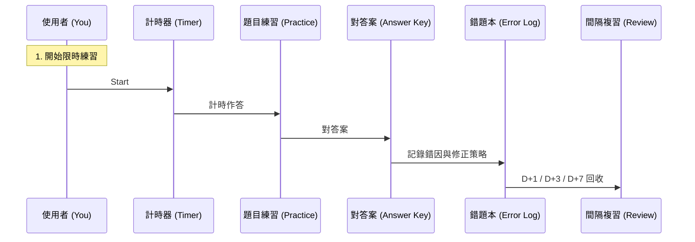

# Project Rules for 30-Days-TOEIC-Gold

> **CRITICAL RULE**: Do NOT automatically proceed to the next day's content without explicit user instruction. Always ask for confirmation before starting a new day.

> **CRITICAL RULE**: Focus on **TOEIC Gold Certificate (860+)** strategies.

# 資料結構 (Directory Structure)
```
toeic-30days/
  day01/  
    README.md  教學＋當天策略
    pic/ 
    notes/   錯題本、同義替換、單字例句
    log.md   成績紀錄（正確率、耗時、錯因統計）
  day02/...
  weekly-tests/
    week1.md
    week2.md
```

# Day XX: [題型/能力主題標題]
(Example: Part 7 雙篇定位與同義替換)

## 1. 今日目標 (Goal)
(簡述今天要練什麼，例如：「掌握 Part 7 雙篇的定位流程，提升作答速度與正確率」)
*   **預期成果**:
    - [ ] 雙篇整組錯題 ≤ 2
    - [ ] 完成時間 ≤ XX 分鐘
    <br/>
    
    <br/>

## 2. 核心觀念 (Key Concepts)
### 2.1 [觀念名稱 1] (Example: 同義替換 Paraphrase)
(解釋：題目怎麼換句話問你、常見替換模式)
> **小撇步**: 看到題幹關鍵字，先想 1～2 個同義詞再回文找

### 2.2 [觀念名稱 2] (Example: 定位線索 Keyword Scanning)
(解釋：人名/日期/金額/地點/部門/附件 等)

### 2.3 練習迴圈圖 (Learning Flow)


## 3. 實作步驟 (Implementation)

### 步驟 1: 今日時間配置 (Time Box)
*   **單字/片語 (15 min)**：從錯題出現的字彙整理。
*   **題型練習 (40 min)**：Part X 集中訓練。
*   **檢討 (25 min)**：錯因分類＋二刷。
*   **錯題本 (10 min)**：填寫固定格式。

### 步驟 2: 今日題量 (Target Volume)
*   **Part X**：__ 題 / __ 組 / __ 篇
*   **限時**：__ 分鐘
*   **目標正確率**：__%

### 步驟 3: 二刷策略 (2nd Pass)
*   **立刻二刷**：今天錯的題目挑 10 題重做。
*   **明天回收**：D+1 全部錯題再做一次（不看答案）。

## 4. 題目解析 (Analysis)

### 錯題本格式 (Error Log Template)
| 題號 | 題型 | 你選的 | 正解 | 錯因 (單字/文法/定位/推論/粗心) | 一句話修正策略 |
| :--- | :--- | :--- | :--- | :--- | :--- |
| Q12 | Part 7 | B | D | 定位 | 先找日期，再找附件對應資訊 |

### 今日常見陷阱 (Common Traps)
*   **Trap 1**: ...
*   **Trap 2**: ...

## 5. 成果展示 (Demo)
*   **完成題量**：__
*   **限時**：__
*   **正確率**：__
*   **錯因統計**：單字 __ / 文法 __ / 定位 __ / 推論 __ / 粗心 __

<br/>

<br/>

## 6. 總結 (Summary)
今天我們完成了：
*   [重點 1]
*   [重點 2]
*   [重點 3]
